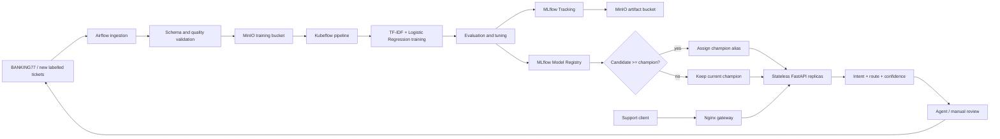

# Assignment 1 — ML System Design

## 1. Problem Statement and Objectives

Customer-support requests must be assigned to the correct department before an agent can start
solving them. Manual triage increases response time and operational workload, while rule-based
routing is unreliable because customers describe the same issue in many different ways. The system
therefore treats routing as a supervised multi-class text-classification problem:

```text
customer query -> predicted intent -> routing group
```

The system is designed for a digital-banking support service. It receives a short English customer
message, predicts one of eight support intents, and maps the prediction to an operational group such
as card support, fraud, transfers, cash operations, or manual review.

The objectives are:

1. Return a predicted intent, routing group, and confidence score for every valid query.
2. Reduce the time and manual work required to route support tickets.
3. Send predictions with confidence below `0.60` to a human-review queue instead of routing them
   automatically.
4. Achieve macro F1 of at least `0.80` on a held-out real-data test set.
5. Keep online prediction p95 latency below `200 ms` under the expected course-demo load.
6. Ingest new labelled tickets regularly and retrain the model when new data or degradation makes
   retraining necessary.
7. Track every experiment and dataset version so that training is reproducible and auditable.
8. Deploy a candidate only if it passes validation and performs at least as well as the current
   champion model.
9. Preserve a human-feedback path so that corrected intents become labelled examples for future
   training runs.

## 2. Diagram of the Overall System Architecture



The diagram represents the complete data and service flow. BANKING77 and newly resolved support
tickets enter the Airflow ingestion process. Validated and normalized data are stored in the
`support-data` MinIO bucket. A Kubeflow pipeline reads the dataset, preprocesses it, trains and tunes
a candidate, evaluates it, and records the experiment in MLflow. MLflow uses PostgreSQL for run and
registry metadata and MinIO for model and evaluation artifacts. The candidate is compared with the
current champion using macro F1. A passing model receives the `champion` alias; otherwise, the
existing champion remains active.

For online inference, a support application sends a JSON request through Nginx to one of the
stateless FastAPI replicas. The replica loads `models:/support-ticket-classifier@champion` from the
MLflow Model Registry and returns the intent, routing group, and confidence. Low-confidence tickets
are sent to manual review. The final agent-selected intent is later returned to the labelled-data
flow, creating a controlled feedback loop.

## 3. ML Model

The first production candidate is a scikit-learn pipeline composed of:

- `TfidfVectorizer`, which transforms query text into numeric TF-IDF features;
- word unigrams and bigrams, which capture both individual terms and short phrases;
- lowercase normalization and a maximum of 20,000 features;
- `LogisticRegression` with balanced class weights for multi-class prediction;
- `GridSearchCV` with three folds to select regularization parameter `C` from `0.5`, `1.0`, and
  `2.0`;
- `predict_proba`, where the largest predicted probability becomes the confidence score.

The model predicts eight intents:

- `activate_my_card`;
- `beneficiary_not_allowed`;
- `card_arrival`;
- `cash_withdrawal_not_recognised`;
- `change_pin`;
- `declined_cash_withdrawal`;
- `pending_transfer`;
- `wrong_exchange_rate_for_cash_withdrawal`.

TF-IDF with logistic regression was selected because it is fast to train, inexpensive to serve on a
CPU, easy to reproduce, and suitable for demonstrating the complete MLOps lifecycle. It also
provides class probabilities needed for the manual-review threshold. A compact transformer may be
introduced later as a challenger if error analysis shows that the baseline cannot handle important
language variations.

The trained object includes both vectorization and classification. This prevents differences
between training and serving transformations. A fixed random seed and stratified splitting make
experiments comparable, while the model version, parameters, dataset information, metrics, and
artifacts are recorded in MLflow.

## 4. Data

**Datasets.** The primary dataset is
[BANKING77](https://huggingface.co/datasets/PolyAI/banking77), which contains 13,083 online-banking
queries across 77 fine-grained intents. The project selects eight intents to keep the course system
small while preserving a realistic multi-class classification problem. A separate 64-row synthetic
CSV file is included only for offline smoke tests and is not used as evidence for the production
quality threshold.

**Data updates.** Airflow runs the ingestion DAG daily. In the course implementation, it downloads
the selected BANKING77 subset and writes the validated result to a stable `latest.csv` object. In a
production system, resolved tickets would be appended under immutable date-partitioned keys, for
example `training/year=2026/month=08/day=24/tickets.csv`, while a `latest` pointer would identify the
current training snapshot. Agent corrections are accepted only after ticket resolution and are not
generated from the model's own prediction, avoiding a self-reinforcing labelling loop.

**Data preprocessing.** Processing follows a deterministic sequence:

1. Retain the `query` and `intent` columns.
2. Reject missing columns, null values, and unsupported labels.
3. Strip surrounding spaces and collapse repeated whitespace.
4. Reject queries shorter than three characters.
5. Remove exact `(query, intent)` duplicates.
6. Check row counts and the minimum number of examples per class.
7. Create a fixed stratified train/test split.
8. Fit TF-IDF only on training folds to prevent data leakage.

**Data management.** Each training run records the object key, number of rows, class distribution,
validation result, random seed, experiment run ID, and resulting model version. Production data may
contain personal information, so account numbers and other identifiers must be redacted before
storage. Buckets must be private, credentials must be supplied through environment variables or
Kubernetes Secrets, and retention/deletion rules must match the organization's privacy policy.

**Data storage.** MinIO provides S3-compatible object storage. The `support-data` bucket stores
training datasets, including `s3://support-data/training/latest.csv`. The separate `mlflow` bucket
stores trained models and evaluation artifacts. PostgreSQL stores structured MLflow run, model
version, tag, and alias metadata. Separating binary artifacts from searchable metadata simplifies
backup, retention, access control, and model lineage.

## 5. Microservices

| Service | Role and function | Communication | Scalability and performance requirements |
|---|---|---|---|
| Airflow | Schedules data acquisition, validation, and upload | Python tasks; S3-compatible API to MinIO | One daily run, two retries, idempotent output, retained task logs |
| Data-validation component | Checks schema, nulls, labels, duplicates, query length, and class counts | Receives a dataframe from ingestion and returns a validated dataset or failure | Must reject every invalid batch; validation should finish within the ingestion run |
| MinIO | Stores versioned datasets, models, and evaluation artifacts | S3-compatible API used by ingestion, training, and MLflow | Capacity scales with retained versions; private buckets, persistent volumes, backups, and encrypted transport in production |
| Kubeflow Pipelines | Orchestrates gathering, validation, training, evaluation, promotion, and serving reload | Kubernetes components exchange parameters and artifact references | One active training pipeline is sufficient for the course; failed steps retry independently; components use immutable images |
| Training service | Preprocesses data, tunes hyperparameters, fits the model, and calculates metrics | Reads data from MinIO and calls the MLflow REST API | One CPU worker; complete the selected dataset in under 10 minutes; deterministic execution |
| MLflow Tracking | Stores runs, parameters, metrics, artifacts, signatures, and lineage | REST API; metadata in PostgreSQL; artifacts in MinIO | Low request volume for the course; persistent backend and controlled access in production |
| MLflow Model Registry | Stores model versions, tags, and `challenger`/`champion` aliases | MLflow API used by training, promotion, and serving | Stable model URI; version lookup and alias reassignment must support rollback in under 10 minutes |
| Promotion service | Compares candidate macro F1 with the champion and controls deployment | Reads MLflow metrics and updates Model Registry aliases | Must never promote a failed or weaker candidate; operation must be auditable and idempotent |
| PostgreSQL | Stores MLflow experiment and registry metadata | SQL connection from MLflow only | Small metadata workload; persistent volume, regular backup, and reliable recovery |
| FastAPI prediction service | Validates requests, loads the champion, predicts intent, maps the route, and reports confidence | JSON/HTTP through Nginx; MLflow API during load/reload | Stateless horizontal replicas; p95 below 200 ms; at least 20 requests/s per replica; readiness endpoint; 2,000-character input limit |
| Nginx gateway | Provides one public endpoint and balances requests across API replicas | HTTP from clients and HTTP to FastAPI replicas | No host-port conflicts during scaling; request-size and timeout limits; TLS and redundant ingress in production |
| Support application | Submits customer queries and displays the resulting route | JSON/HTTPS request and response through Nginx | Must handle service errors and expose manual routing if prediction is unavailable |
| Human-review queue | Receives uncertain predictions and captures the final corrected intent | Prediction output to agents; resolved labels return to ingestion | Must receive every prediction below confidence `0.60`; should preserve ticket and correction lineage |

The main synchronous interaction is online inference: client → Nginx → FastAPI → prediction
response. Training is batch-oriented: Airflow/MinIO → Kubeflow components → MLflow/Registry. A
message queue is unnecessary for the course workload because training is scheduled and inference
requires an immediate response. If production traffic or asynchronous integrations grow
substantially, a queue can be introduced without changing the model interface.

## 6. Tools and Technologies

| Tool or technology | Purpose in the system |
|---|---|
| Python 3.12 | Main implementation language |
| pandas | Loading, cleaning, validating, and splitting tabular text data |
| scikit-learn | TF-IDF features, logistic-regression classifier, grid search, and evaluation metrics |
| FastAPI | Typed REST prediction API and automatic OpenAPI documentation |
| Uvicorn | ASGI server for FastAPI |
| Docker | Reproducible images for training, serving, Airflow, and MLflow |
| Docker Compose | Local orchestration of the complete course environment |
| Apache Airflow | Scheduled data-ingestion workflow, retries, and execution logs |
| MinIO | S3-compatible storage for datasets and MLflow artifacts |
| MLflow Tracking | Experiment parameters, metrics, artifacts, and lineage |
| MLflow Model Registry | Model versions and `challenger`/`champion` aliases |
| PostgreSQL | Persistent MLflow metadata backend |
| Kubeflow Pipelines v2 | Complete containerized ML workflow for a Kubernetes environment |
| Nginx | Stable API endpoint and load balancing across stateless replicas |
| pytest | Automated tests for validation, routing, and model training |
| Ruff | Static code-quality and style checks |
| Git | Source-code and configuration version control |

## 7. Measuring Performance of the ML Model

The dataset is divided using a fixed stratified train/test split so that every intent is represented
in both parts. Hyperparameter selection is performed with three-fold cross-validation on the
training portion only. The held-out test set is used once for the final candidate evaluation.

The primary promotion metric is **macro F1** because it calculates F1 independently for each intent
and weights all intents equally. This prevents a large class from hiding weak performance on a
smaller but operationally important intent. **Accuracy** is reported as an intuitive overall value,
while **per-class precision, recall, and F1** are used for error analysis. Per-class recall is
especially important for fraud-related requests, where a missed ticket can be more costly than an
additional manual review.

| Measurement | Purpose | Required level |
|---|---|---:|
| Macro F1 | Primary balanced model-quality and promotion metric | `>= 0.80` |
| Accuracy | Overall share of correct predictions | Reported for every run |
| Per-class recall | Detects intents that the model frequently misses | `>= 0.70` for every intent |
| Per-class precision and F1 | Supports class-specific error analysis | Monitored for every intent |
| Cross-validation macro F1 | Compares hyperparameter configurations | Select the highest mean value |
| Low-confidence rate | Measures how often predictions require manual review | Monitored for distribution changes |
| Prediction distribution | Detects changes in intent frequency | Compared with the training baseline |

Every run stores its metrics and classification report in MLflow. A newly registered model first
receives the `challenger` alias. Promotion occurs only when:

```text
candidate_macro_f1 >= champion_macro_f1 + minimum_required_improvement
```

The course configuration uses `minimum_required_improvement = 0.0`, which prevents regression. In
addition to offline metrics, the service monitors request count, latency, error rate, confidence,
low-confidence rate, and predicted-intent distribution. When delayed agent labels become available,
weekly macro F1 and per-class recall can be calculated on real traffic. Drift starts an
investigation or retraining run, but it does not automatically promote a new model.

## 8. Success Criteria (Technical and Business)

| Category | Success criterion | Target or evidence |
|---|---|---|
| Technical | Held-out classification quality | Macro F1 `>= 0.80` |
| Technical | No consistently weak intent | Per-class recall `>= 0.70` |
| Technical | Safe uncertain predictions | Every confidence below `0.60` is routed to manual review |
| Technical | Online inference latency | p95 `< 200 ms` under the expected load |
| Technical | Service availability | `>= 99.5%` in the intended production setting |
| Technical | Data quality | Zero invalid records admitted after validation |
| Technical | Reproducibility | Dataset reference, seed, parameters, metrics, artifacts, and model version recorded for every run |
| Technical | Controlled deployment | Only a candidate that passes the quality gate receives the `champion` alias |
| Technical | Scalability | API can run multiple stateless replicas behind one Nginx endpoint |
| Technical | Recovery | Previous model restored in under 10 minutes by reassigning the champion alias |
| Business | Correct automatic routing | At least 75% of eligible tickets routed correctly without manual triage |
| Business | Manual triage reduction | At least 40% lower workload than the original manual process |
| Business | Faster first response | Lower median time from ticket creation to assignment to the correct group |
| Business | Fraud-routing safety | No increase in missed high-risk fraud tickets compared with the manual baseline |
| Business | Useful feedback loop | Agent corrections become traceable labelled examples for later retraining |

Technical success requires a reproducible end-to-end pipeline, a model that passes the quality
threshold, controlled champion promotion, reliable online inference, and demonstrated rollback.
Business success requires faster and more accurate ticket assignment while reducing manual work
without increasing risk for sensitive categories.
