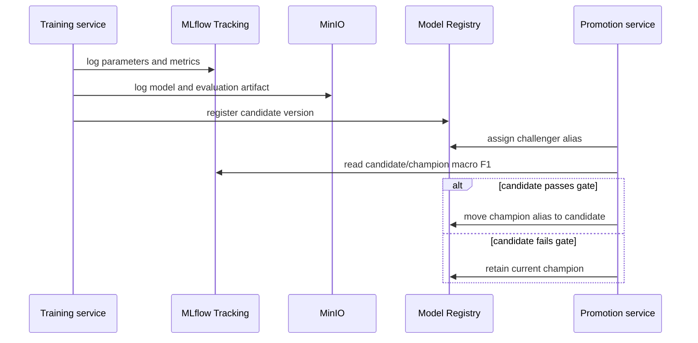

# Assignment 3 — MLflow, Scalable Serving and Champion–Challenger

## Result

The training service now records parameters, evaluation metrics and artifacts in MLflow. Model
metadata is durable in PostgreSQL, artifacts are stored in MinIO, each run creates a registry version,
and an explicit comparison decides whether the candidate can replace the production champion.
Serving is stateless and can be scaled behind a single Nginx endpoint.

## 1. MLflow backend

The Compose stack deploys:

- MLflow Tracking/Registry at `http://localhost:5000`;
- PostgreSQL backend store at `postgresql+psycopg2://.../mlflow`;
- MinIO artifact destination `s3://mlflow`;
- `--serve-artifacts`, so clients use the MLflow server rather than direct MinIO URLs.

Every training run logs:

| Type | Values |
|---|---|
| Parameters | algorithm, best `C`, row count, number of classes |
| Metrics | accuracy and macro F1 |
| Artifact | per-class classification report JSON |
| Model metadata | inferred model signature and registered model URI |
| Lineage | experiment run ID linked to the registered model version |

MLflow's Model Registry provides centralized versioning, lineage, tags and aliases; the official
[Model Registry documentation](https://mlflow.org/docs/latest/ml/model-registry/) recommends aliases
such as `champion` for deployment references.

## 2. Training and registration flow



The code is split between `train.py` and `promote.py`. Registration does not imply deployment; this
separation makes the decision auditable and prevents an accidentally weak training run from serving.

## 3. Champion–challenger policy

The candidate is always assigned `challenger`. The promotion service retrieves macro F1 from the
candidate's MLflow run and compares it to the model referenced by `champion`:

```text
promote when candidate_macro_f1 >= champion_macro_f1 + min_improvement
```

The first valid version becomes champion because no incumbent exists. The default
`min_improvement=0.0` means “no regression”; a stricter production deployment can require `0.01`.
Tags record `validation_status=evaluated`, `deployment_status=champion`, and
`deployment_status=archived`. The old version remains available for rollback.

Manual promotion demo after a registered training run:

```bash
python -m support_classifier.promote --version 2 --min-improvement 0.01
```

The production URI is stable even when its target changes:

```text
models:/support-ticket-classifier@champion
```

## 4. Scalable model service

The FastAPI service contains no session or model state outside process memory. All replicas read the
same champion alias and return the same JSON contract. Nginx exposes one endpoint and distributes
requests across the `api` service replicas.

Scale to three replicas:

```bash
docker compose up -d --no-deps --scale api=3 api gateway
docker compose ps
```

Because only `gateway` publishes host port 8000, replicas do not conflict over ports. After a model
promotion, `POST /reload` replaces the in-memory model without changing the public endpoint. In a
real Kubernetes deployment, readiness probes and a rolling restart provide zero-downtime rollout.

## 5. Failure and rollback behaviour

| Failure | Behaviour |
|---|---|
| Training exception | No model version is registered; champion is unchanged |
| Artifact upload failure | Run fails and promotion is not called |
| Candidate metric below gate | Candidate remains challenger; champion is unchanged |
| New model cannot load | `/reload` returns 503; existing process should be restarted only after diagnosis |
| Production regression | Reassign `champion` alias to the prior version and reload replicas |
| MLflow temporarily unavailable | A running replica continues with its in-memory model |

## 6. Demonstration

```bash
docker compose up --build -d
open http://localhost:5000
curl -s http://localhost:8000/health
curl -s http://localhost:8000/predict \
  -H 'Content-Type: application/json' \
  -d '{"query":"Someone withdrew cash using my card"}'
```

In the MLflow UI, the `support-ticket-classification` experiment shows parameters, metrics and the
evaluation artifact. The Models page shows `support-ticket-classifier` with `champion` and
`challenger` aliases.

The verified integration run produced three registry versions. Version 1 was the intentionally small
offline smoke-test model (macro F1 `0.5917`); versions 2 and 3 were trained on 1,552 selected BANKING77
queries and both reached accuracy `0.9716` and macro F1 `0.9726`. The promotion gate therefore moved
both `challenger` and `champion` to version 3. This also demonstrates that a substantially weaker
candidate can remain stored for lineage without becoming the serving target.

## 7. Requirement traceability

| Assignment requirement | Evidence |
|---|---|
| Add MLflow tracking | `train.py`, MLflow service and PostgreSQL backend |
| Save artifacts to object storage | MLflow `s3://mlflow` artifact destination in MinIO |
| Make model service scalable | Stateless API, Nginx gateway and Compose replica command |
| Challenger–champion deployment | `promote.py`, registry aliases and metric quality gate |
