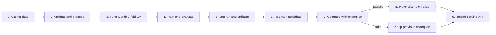

# Assignment 4 — Complete Kubeflow MLOps Pipeline

## Result

The previous components are assembled into a Kubeflow Pipelines v2 workflow. It gathers and
validates data, tunes and trains the classifier, logs/registers it in MLflow, evaluates the
challenger against the champion, and reloads serving only after the quality gate. The same component
image and environment contract are used locally and on Kubernetes.

## 1. Final pipeline



Implementation: `kubeflow/pipeline.py`. Compilation produces `support_pipeline.yaml`, which can be
uploaded to a Kubeflow Pipelines UI. Kubeflow's compiler converts the Python pipeline into an IR YAML
submission package as described in its
[official compilation guide](https://www.kubeflow.org/docs/components/pipelines/user-guides/core-functions/compile-a-pipeline/).

## 2. Pipeline steps

| Step | Container action | Inputs/outputs and gate |
|---|---|---|
| Gather | `python -m support_classifier.ingest` | Writes normalized dataset to MinIO |
| Validate | `python -m support_classifier.validate` | Fails on schema, null or class-size violations |
| Tune/train/register | `python -m support_classifier.train` | Grid-searches `C`; logs metrics/artifacts; outputs model-version file |
| Evaluate/promote | `python -m support_classifier.promote` | Reads version file; moves alias only when macro-F1 gate passes |
| Serve | `POST /reload` from a curl component | API replicas resolve current `@champion` |

Training incorporates data processing and optional parameter tuning in one container because both
must fit transformations only on training folds. Kubeflow still exposes it as a distinct named step,
and MLflow stores each tried run's selected parameter and final held-out metrics.

## 3. Infrastructure integration

The local Compose stack is the development equivalent of the target Kubernetes setup:

| Local service | Kubernetes/Kubeflow equivalent |
|---|---|
| Compose application container | Container image in a cluster-accessible registry |
| MinIO volume | Persistent MinIO/S3 object storage |
| MLflow + PostgreSQL | In-cluster or managed MLflow backend |
| Airflow DAG | Existing scheduled upstream ingestion; pipeline can also invoke ingestion |
| Nginx + scaled API | Kubernetes Service/Ingress + Deployment replicas |
| Compose `pipeline` service | Kubeflow PipelineRun |

Secrets required in the Kubeflow runtime are `AWS_ACCESS_KEY_ID`, `AWS_SECRET_ACCESS_KEY`, MinIO
endpoint, and MLflow tracking URI. They should be provided through Kubernetes Secrets and injected
into component pods. The course repository intentionally contains only local demo credentials.

## 4. Compile and run

Build and publish the shared component image:

```bash
docker build -f docker/Dockerfile -t REGISTRY/support-classifier:0.1.0 .
docker push REGISTRY/support-classifier:0.1.0
```

Compile the pipeline:

```bash
python -m venv .venv
. .venv/bin/activate
pip install '.[kubeflow]'
python kubeflow/pipeline.py
```

Set `DEFAULT_IMAGE` in `kubeflow/pipeline.py` to the pushed immutable image, compile it, and provide:

- `c_values`: comma-separated search grid;
- `min_improvement`: required macro-F1 gain;
- `serving_url`: in-cluster URL of the prediction service.

For a no-cluster course demo, `docker compose up --build` exercises the same logical workflow through
`support_classifier.pipeline_run` and exposes the UIs and API locally.

## 5. Evaluation and serving decision

The evaluation step reads model-version lineage from MLflow rather than accepting a metric supplied
by the caller. This prevents a mismatched score from promoting the wrong artifact. The registry alias
is updated atomically; the public model URI does not change. If the candidate fails, the final reload
is harmless because it reloads the unchanged champion.

Recommended gates for the full BANKING77 subset:

- macro F1 >= 0.80 absolute release threshold;
- candidate macro F1 >= champion macro F1;
- every class has recall >= 0.70;
- prediction contract smoke test passes;
- no invalid data-quality checks.

The verified local run used 1,552 selected BANKING77 queries and achieved accuracy 0.9716 and macro
F1 0.9726 with `C=2.0`, so it passes the absolute course gate. Real support data would still require a
separate temporal holdout and agent-reviewed evaluation before deployment.

The course implementation automates the relative macro-F1 gate. The absolute and per-class gates are
documented release checks and can be added to `promote.py` when enough representative labelled data
is available.

## 6. Observability

- Kubeflow: component status, retries, parameters and execution logs;
- MLflow: experiments, metrics, artifacts, model lineage, versions and aliases;
- Airflow: scheduled source-refresh history and retry logs;
- API: readiness, total predictions and low-confidence count;
- MinIO: immutable dataset/model objects.

Production additions would include Prometheus latency/error histograms, alerting, weekly labelled
macro F1, prediction-distribution drift, and a dead-letter path for invalid records.

## 7. Short presentation/demo outline

1. Problem: support tickets wait for manual triage.
2. Architecture: Airflow/MinIO -> Kubeflow training -> MLflow registry -> scalable FastAPI.
3. Data/model: eight BANKING77 intents and TF-IDF logistic regression.
4. Live demo: trigger ingestion, inspect MLflow run, call `/predict`.
5. Safety: low-confidence manual review and champion–challenger gate.
6. Result and next step: replace synthetic smoke data with agent-labelled production batches.

The executable sequence, URLs and expected checks are in `reports/demo.md`.

## 8. Requirement traceability

| Assignment requirement | Evidence |
|---|---|
| Full pipeline on SageMaker/Databricks/Kubeflow | Kubeflow v2 pipeline definition and compile instructions |
| Data gathering | Airflow DAG and Kubeflow gather component |
| Data processing | Cleaning and validation module/component |
| Model training | TF-IDF/logistic training container |
| Parameter tuning | Three-fold `C` grid search |
| Register model | MLflow registered model version |
| Log needed metrics | Accuracy, macro F1, parameters, signature, per-class report |
| Compare with previous model | Champion–challenger macro-F1 gate |
| Serve the best model | Stable `@champion` URI and API reload component |
| Presentation/demo | Outline above and executable demo guide |
